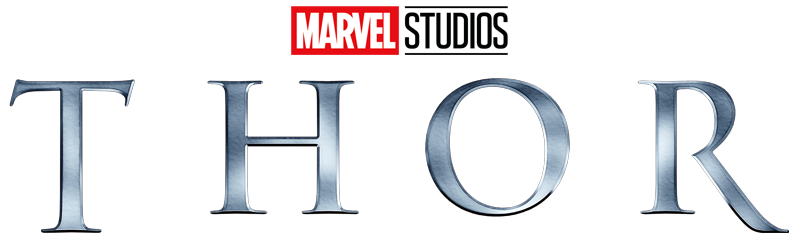

<div align="center">  </div>

<div align="center">

<div align="center">


</div>

---

<p align="center">
  <a href="#how-to-access-the-project">View Project</a>
</p>

---

## ⚡ About the project

A landing page inspired by **Thor: God of Thunder**, built to promote the character's story on the big screen through a bold, cinematic interface, smooth animations, and immersive visuals.

The project simulates an official movie promotional page, presenting Thor's story and driving users toward the trailer and ticket sections.

- Full-screen hero section with background art
- Cinematic storytelling copy
- Trailer and ticket call-to-action sections
- Scroll-based animations
- Responsive layout
- Modern landing page structure

## 🧩 Technologies used

* **HTML**
* **CSS**
* **JavaScript**
* **GSAP (GreenSock)**
* **Web3D**

## 🎨 Features

* ⚡ Hero section with logo and navigation (TRAILER, ABOUT, TICKETS)
* 🎬 "Watch the Trailer" and "Guarantee Your Ticket" call-to-action buttons
* 📖 Narrative section about Thor's story
* 🎥 Closing section — "The Storm Arrives at Cinemas"
* ⏳ Animated preloader

## 📱 Responsiveness

The layout was built to adapt to different screen sizes, ensuring a smooth experience on both mobile and desktop.

<h2 id="how-to-access-the-project">⚙️ How to access the project</h2>

Access it directly via GitHub Pages:

https://jarmeloo.github.io/ThorLandingPage/

Or, if you'd rather run it locally:

1. Clone the repository:
```bash
git clone https://github.com/jarmeloo/ThorLandingPage.git
```

2. Open the file:
```bash
index.html
```

3. Or use an extension like **Live Server** in VS Code

## 🧠 Takeaways

This project involved working with concepts such as:

* Structuring cinematic, story-driven landing pages
* Scroll-based animations with GSAP
* HTML and CSS best practices for promotional pages
* Building responsive interfaces

## 🧑‍💻 Author

Johann Jarmelo
